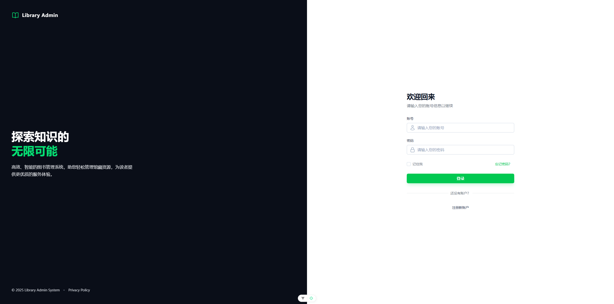
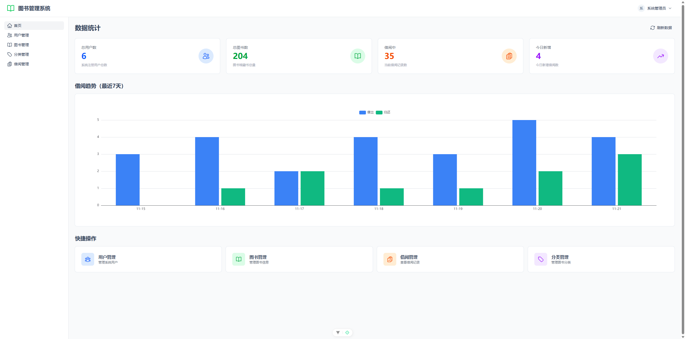
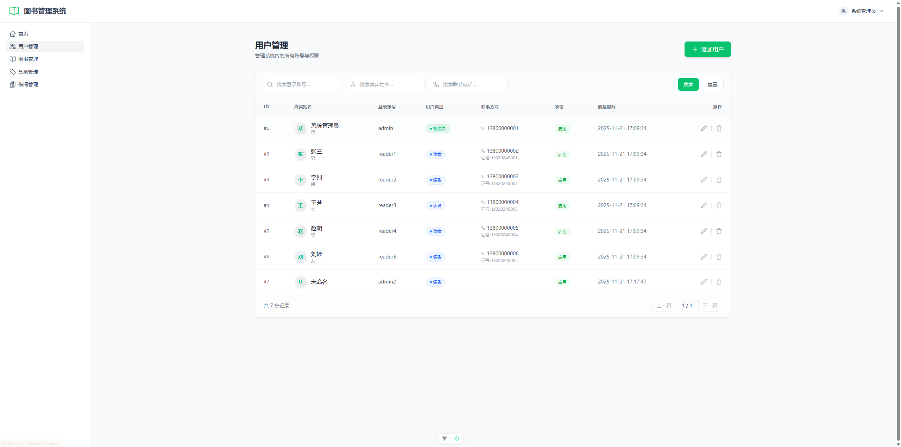
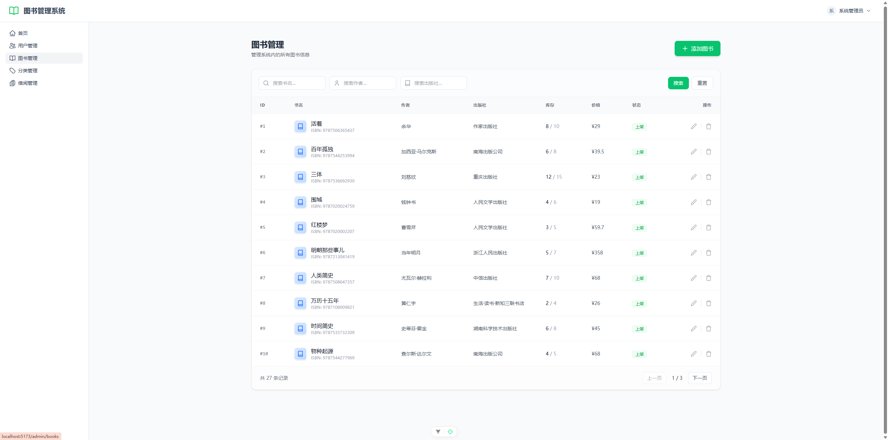
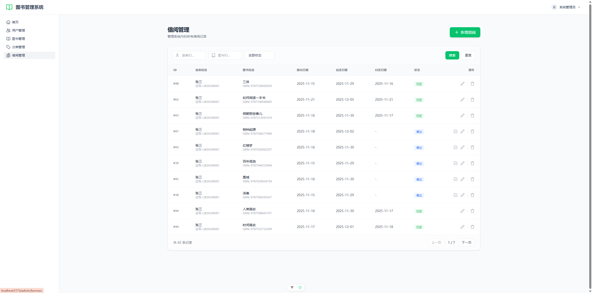
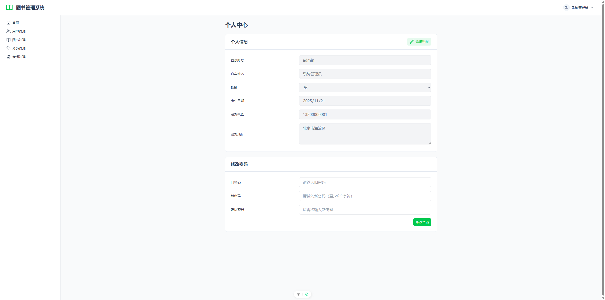

# 图书管理系统

一个基于 Spring Boot + Vue 3 的现代化图书管理系统，提供完整的图书借阅管理功能。

## 项目简介

本系统是一个全栈图书管理解决方案，包含管理员端和读者端两个角色，实现了图书管理、用户管理、借阅管理等核心功能。系统采用前后端分离架构，后端使用 Spring Boot 提供 RESTful API，前端使用 Vue 3 + Nuxt 4 构建现代化用户界面。

## 技术栈

### 后端技术
- **Spring Boot 2.7.2** - 核心框架
- **Spring MVC** - Web 框架
- **MyBatis-Plus** - ORM 框架
- **MySQL** - 数据库
- **Hutool** - Java 工具库
- **Knife4j** - API 文档工具
- **Lombok** - 简化 Java 代码

### 前端技术
- **Vue 3** - 渐进式 JavaScript 框架
- **Nuxt 4** - Vue 全栈框架
- **Nuxt UI** - UI 组件库
- **Pinia** - 状态管理
- **Vue Router** - 路由管理
- **Axios** - HTTP 客户端
- **ECharts** - 数据可视化
- **TypeScript** - 类型安全
- **Tailwind CSS** - 原子化 CSS 框架

## 功能特性

### 管理员功能
- ✅ **数据统计仪表盘** - 实时展示系统关键指标和借阅趋势图表
- ✅ **用户管理** - 用户的增删改查、状态管理
- ✅ **图书管理** - 图书信息维护、库存管理
- ✅ **分类管理** - 图书分类的组织和管理
- ✅ **借阅管理** - 借阅记录查询、借还书操作
- ✅ **个人中心** - 个人信息编辑、密码修改

### 读者功能
- ✅ **图书浏览** - 浏览和搜索图书
- ✅ **借阅记录** - 查看个人借阅历史
- ✅ **个人中心** - 管理个人信息

### 系统特性
- 🔐 **权限控制** - 基于角色的访问控制（RBAC）
- 📊 **数据可视化** - ECharts 图表展示借阅趋势
- 🎨 **响应式设计** - 适配各种屏幕尺寸
- 🌙 **深色模式** - 支持明暗主题切换
- 💾 **状态持久化** - 登录状态自动保存
- 🔄 **实时刷新** - 数据实时更新

## 系统截图

### 登录页面


### 管理员仪表盘


### 用户管理


### 图书管理


### 借阅管理


### 个人中心


## 项目结构

```
library-admin/
├── library-admin-backend/          # 后端项目
│   ├── src/main/java/
│   │   └── com/libraryadminbackend/
│   │       ├── annotation/         # 自定义注解
│   │       ├── aop/               # AOP 切面
│   │       ├── common/            # 公共类
│   │       ├── config/            # 配置类
│   │       ├── constant/          # 常量定义
│   │       ├── controller/        # 控制器
│   │       ├── exception/         # 异常处理
│   │       ├── mapper/            # MyBatis Mapper
│   │       ├── model/             # 数据模型
│   │       │   ├── entity/        # 实体类
│   │       │   ├── dto/           # 数据传输对象
│   │       │   ├── vo/            # 视图对象
│   │       │   └── enums/         # 枚举类
│   │       └── service/           # 业务逻辑
│   └── src/main/resources/
│       ├── application.yml        # 应用配置
│       └── mapper/                # MyBatis XML
│
├── library-admin-frontend/         # 前端项目
│   ├── src/
│   │   ├── api/                   # API 接口
│   │   ├── assets/                # 静态资源
│   │   ├── components/            # 公共组件
│   │   ├── layouts/               # 布局组件
│   │   ├── pages/                 # 页面（Nuxt 路由）
│   │   ├── stores/                # Pinia 状态管理
│   │   ├── views/                 # 视图组件
│   │   │   ├── admin/             # 管理员页面
│   │   │   └── user/              # 读者页面
│   │   ├── router/                # 路由配置
│   │   └── app.vue                # 根组件
│   ├── nuxt.config.ts             # Nuxt 配置
│   └── package.json               # 依赖配置
│
├── docs/                          # 文档目录
│   └── images/                    # 截图目录
└── README.md                      # 项目说明
```

## 快速开始

### 环境要求

- **JDK 8+** - Java 开发环境
- **Maven 3.6+** - 项目构建工具
- **Node.js 20.19.0+** - JavaScript 运行环境
- **MySQL 5.7+** - 数据库

### 后端启动

1. **创建数据库**
```sql
CREATE DATABASE library_db CHARACTER SET utf8mb4 COLLATE utf8mb4_unicode_ci;
```

2. **导入数据库表结构**
   - 执行 `library-admin-backend/sql/schema.sql` 创建表结构
   - 执行 `library-admin-backend/sql/data.sql` 导入初始数据（可选）

3. **配置数据库连接**

编辑 `library-admin-backend/src/main/resources/application.yml`：
```yaml
spring:
  datasource:
    url: jdbc:mysql://localhost:3306/library_db
    username: your_username
    password: your_password
```

4. **启动后端服务**
```bash
cd library-admin-backend
./mvnw spring-boot:run
```

后端服务将在 `http://localhost:8123` 启动

API 文档地址：`http://localhost:8123/api/doc.html`

### 前端启动

1. **安装依赖**
```bash
cd library-admin-frontend
npm install
```

2. **配置后端 API 地址**（可选）

如果后端地址不是默认的 `http://localhost:8123`，可以在 `.env` 文件中配置：
```env
NUXT_PUBLIC_API_BASE=http://your-backend-url:port/api
```

3. **启动开发服务器**
```bash
npm run dev
```

前端服务将在 `http://localhost:3000` 启动

### 默认账号

**管理员账号：**
- 用户名：`admin`
- 密码：`123456`

**读者账号：**
- 用户名：`reader`
- 密码：`123456`

## 开发指南

### 后端开发

#### 构建项目
```bash
cd library-admin-backend
./mvnw clean package
```

#### 运行测试
```bash
./mvnw test
```

#### 多环境配置
- `application-dev.yml` - 开发环境
- `application-test.yml` - 测试环境
- `application-prod.yml` - 生产环境

切换环境：
```yaml
spring:
  profiles:
    active: dev  # dev/test/prod
```

### 前端开发

#### 构建生产版本
```bash
cd library-admin-frontend
npm run build
```

#### 预览生产构建
```bash
npm run preview
```

#### 代码检查
```bash
npm run lint
```

#### 类型检查
```bash
npm run type-check
```

## 核心功能说明

### 1. 数据统计仪表盘
- 实时显示总用户数、总图书数、借阅中数量、今日新增借阅
- ECharts 图表展示最近7天借阅趋势
- 快捷操作入口，一键跳转各功能模块

### 2. 用户管理
- 支持用户的增删改查
- 用户状态管理（启用/禁用）
- 分页查询和搜索功能
- 区分管理员和读者角色

### 3. 图书管理
- 图书信息的完整管理
- 图书分类关联
- 库存数量管理
- 图书状态控制（上架/下架）

### 4. 借阅管理
- 借书和还书操作
- 借阅记录查询
- 逾期提醒
- 借阅统计分析

### 5. 权限控制
- 基于注解的权限验证 `@AuthCheck`
- Session 会话管理
- 角色路由守卫
- 自动登录状态保持

## 数据库设计

### 核心表结构

- **user** - 用户表（管理员和读者）
- **book_info** - 图书信息表
- **class_info** - 图书分类表
- **lendlist** - 借阅记录表

详细表结构请参考 `library-admin-backend/sql/schema.sql`

## API 接口

### 用户相关
- `POST /api/user/register` - 用户注册
- `POST /api/user/login` - 用户登录
- `POST /api/user/logout` - 用户登出
- `GET /api/user/get/login` - 获取当前登录用户
- `POST /api/user/list/page` - 分页查询用户
- `POST /api/user/add` - 添加用户
- `POST /api/user/update` - 更新用户
- `POST /api/user/delete` - 删除用户

### 图书相关
- `POST /api/book/list/page` - 分页查询图书
- `POST /api/book/add` - 添加图书
- `POST /api/book/update` - 更新图书
- `POST /api/book/delete` - 删除图书

### 借阅相关
- `POST /api/lend/list/page` - 分页查询借阅记录
- `POST /api/lend/borrow` - 借书
- `POST /api/lend/return` - 还书

### 统计相关
- `GET /api/dashboard/overview` - 获取概览统计
- `GET /api/dashboard/borrow-trend` - 获取借阅趋势

完整 API 文档：`http://localhost:8123/api/doc.html`

## 部署说明

### 后端部署

1. **打包应用**
```bash
cd library-admin-backend
./mvnw clean package -DskipTests
```

2. **运行 JAR 包**
```bash
java -jar target/library-admin-backend-0.0.1-SNAPSHOT.jar --spring.profiles.active=prod
```

### 前端部署

1. **构建生产版本**
```bash
cd library-admin-frontend
npm run build
```

2. **部署到服务器**
   - 将 `.output` 目录上传到服务器
   - 使用 Node.js 运行：`node .output/server/index.mjs`
   - 或使用 PM2：`pm2 start .output/server/index.mjs --name library-admin`

### Nginx 配置示例

```nginx
server {
    listen 80;
    server_name your-domain.com;

    # 前端
    location / {
        proxy_pass http://localhost:3000;
        proxy_set_header Host $host;
        proxy_set_header X-Real-IP $remote_addr;
    }

    # 后端 API
    location /api {
        proxy_pass http://localhost:8123;
        proxy_set_header Host $host;
        proxy_set_header X-Real-IP $remote_addr;
    }
}
```

## 常见问题

### 1. 后端启动失败
- 检查 MySQL 是否启动
- 检查数据库连接配置是否正确
- 检查端口 8123 是否被占用

### 2. 前端无法连接后端
- 检查后端服务是否正常运行
- 检查 API 地址配置是否正确
- 检查浏览器控制台是否有 CORS 错误

### 3. 图表不显示
- 检查是否有借阅数据
- 打开浏览器控制台查看错误信息
- 确认 ECharts 库已正确安装

### 4. 登录后跳转失败
- 清除浏览器缓存和 Cookie
- 检查路由配置是否正确
- 查看浏览器控制台错误信息

## 贡献指南

欢迎提交 Issue 和 Pull Request！

1. Fork 本仓库
2. 创建特性分支 (`git checkout -b feature/AmazingFeature`)
3. 提交更改 (`git commit -m 'Add some AmazingFeature'`)
4. 推送到分支 (`git push origin feature/AmazingFeature`)
5. 开启 Pull Request

## 开源协议

本项目采用 MIT 协议开源，详见 [LICENSE](LICENSE) 文件。

## 联系方式

如有问题或建议，欢迎通过以下方式联系：

- 提交 Issue
- 发送邮件

## 更新日志

### v1.0.0 (2024-11-21)
- ✨ 完成管理员仪表盘统计功能
- ✨ 实现用户管理模块
- ✨ 实现图书管理模块
- ✨ 实现分类管理模块
- ✨ 实现借阅管理模块
- ✨ 添加个人中心功能
- ✨ 集成 ECharts 图表展示
- 🎨 优化 UI 界面和交互体验
- 🐛 修复登录跳转问题
- 🐛 修复头像显示问题

---

**⭐ 如果这个项目对你有帮助，请给个 Star 支持一下！**
